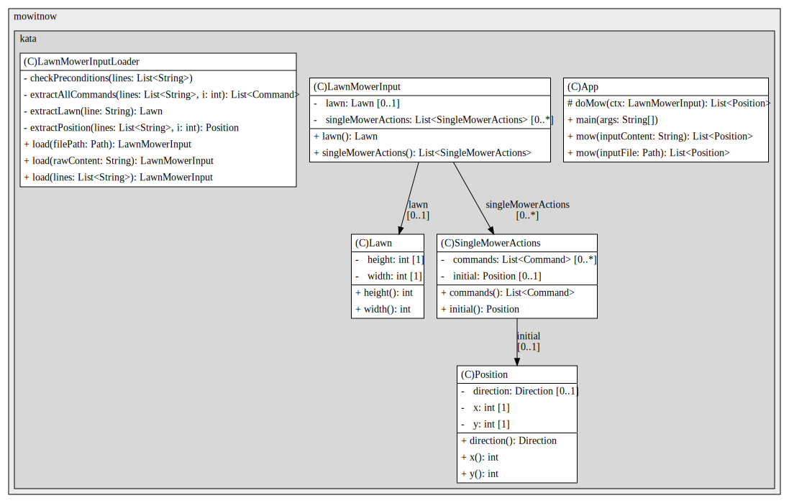

# MowItNow : Automatic lawnmower
___

### Context
The lawnmower
The MowItNow company decided to develop an automatic lawn mower,
intended for rectangular surfaces.

The mower can be programmed to cover the entire surface. There
mower position is represented by a combination of coordinates (x,y)
and a letter indicating the orientation according to English cardinal notation (N,E,W,S).

The lawn is divided into a grid to simplify navigation.

For example, the position of the mower could be "0, 0, N", which means that it
is located in the lower left corner of the lawn, and oriented towards the North.

To control the mower, we send it a simple sequence of letters. Letters
possible are “D”, “G” and “A”. “D” and “G” rotate the mower 90° to
right or left respectively, without moving it. “A” means moving forward
mower one square in the direction it faces, and without changing
its orientation.

If the position after movement is outside the lawn, the mower will not move
step, maintains its orientation and processes the next command.
We presuppose that the box directly north of position (x, y) has
coordinates (x, y+1).

To program the mower, we provide it with an input file constructed like
follows:

The first line corresponds to the coordinates of the upper right corner of the
lawn, those in the lower left corner are assumed to be (0,0)

The rest of the file allows you to control all the mowers that have been
deployed. Each mower has two lines about it:

- the first line gives the initial position of the mower, as well as
its orientation. Position and orientation are provided in the form
2 numbers and a letter, separated by a space

- the second line is a series of instructions directing the mower
to explore the lawn. Instructions are a sequence of characters without
spaces.

Each mower moves sequentially, meaning the second
mower only moves when the first has completed its series
of instructions. When a mower completes a series of instructions, it communicates its position
and its orientation.

###### OBJECTIVE
Design and write a program in Java. This program must implement the
specification above and pass the test below.

###### TEST
The following file is provided as input: 5 5 1 2 N GAGAGAGAA 3 3 E AADAADADDA
We expect the following result (final position of the mowers): 1 3 N 5 1 E NB: The
Input data is injected as a file.

### Design

### Solution

Our solution is merely done by using behavior attached to component that modelize a real type enumeration, thus,
a **Direction** is an enumeration class that provide it a type and additional behavior, in same way, a **Command**, that provide a action, is an enumeration as well.
this design permits us to avoid moistly flaky case like ~~if..else if..~~ cascading : we added custom behavior on component when it makes sense

A dedicated component for input file loader has been built : it can takes as input a raw multine string content or an input file

Thanks to java 17 and pattern matching flavor, we used _switch_ new form that produce compact code like kotlin form
Each component has been unit testing in most ways, though, we can go further with Fuzz testing to discover more unit test scenarios.

- Main class : com.mowitnow.kata.lawnmower.application.App.java;
- Main Unit Test class : com.mowitnow.kata.lawnmower.application.AppTest.java;

### Interaction
Generate a sequence diagram to understand involving components during execution

